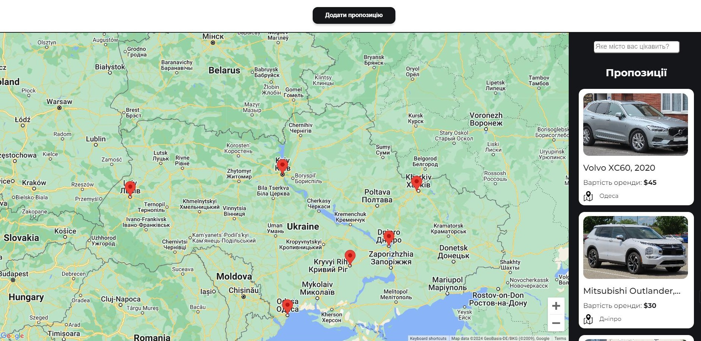

# Map Test Task

The website with a map integrating.

## Technologies used:

- React.js
- Styled Components
- Firebase
- Google Maps

## Live page

The live page can be accessed through the following link:

## Test Task

The website needs to integrate a map. When clicking on a point on the map,
information about it with a photo should appear on the right.

It is also necessary to implement the functionality of adding an advertisement
(you can come up with any interface). After adding, another point should be
added to the map with corresponding information. By default, on the right, there
should be a list of all available advertisements on the map (if we zoom in, only
those advertisements that are in this area should be displayed on the right).

Ideally, it would be if you could implement the MVC pattern. That is, data will
be retrieved from the database and then displayed on the frontend.
